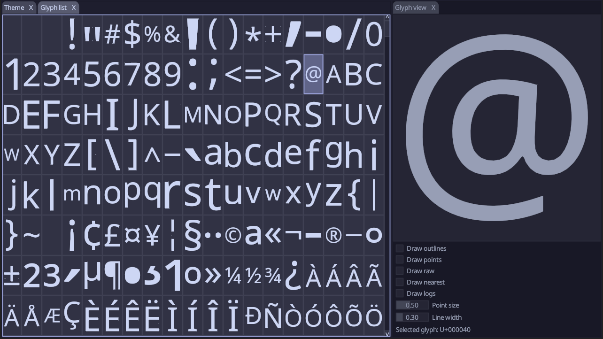

# MSDF-gen

This project is meant as a reference implementation of MSDF generation, all
code relevant for it can be found in `src/font/font_msdf.c` and
`src/font/font_msdf.h`.  Any other primitives that are used can be found in
`src/base`.

MSDFs are generated using the direct multi-channel distance field construction
method described in [Viktor Chlumskys master's thesis][thesis]. I haven't
implemented the collision correction they describe yet, and so there are still
some artifacts.

The approach described in the thesis makes three assumptions that TTF-files do
not satisfy:

1. Contours do not overlap each other.
2. Contours do not self-intersect.
3. A contours winding number in isolation determines if it adds or removes area
   to the shape.

These constraints turn out to be useful when generating MSDFs, but are annoying
when designing fonts, so we have to convert between the two forms. This is done
by first taking the TTF-encoded contours and loading them in to a uniform
format without any implied control points. Then we take any contours that
overlap, cut then up and shuffle around their pieces so that any contour only
ever intersects with itself. After that, we make sure that contours that
intersect themselves are split into multiple non-self-intersecting contours.

At this point we have contours that represents the exact same thing as the
original one, just without any overlap or self-intersections. TrueType allows
winding numbers of contours to combine in order to cut out holes and combine
shapes (non 0 fill rule). The MSDF algorithm considers contours in isolation
and thus we need to correct the winding numbers. After this pre-processing, the
contours can be sent of for MSDF generation.

## Building and Running

### Windows

Search for `x64 Native Tools Command Prompt for VS <year>` in the Windows Start
Menu. Navigate to the project root and run `scripts\build_msvc.bat`. If you
want a release build, append `release` before running the build script.

### Linux

The program runs under both X11 and Wayland, and depending on which you want to
run you will need different dependencies. The exact names might vary depending
on your distro.

* X11: `xcb`, `xcb-cursor`, `egl`, `xkbcomon-x11`, `xkbcommon`
* Wayland: `wayland`, `wayland-protocols`, `egl`, `xkbcommon`

You will also need clang. Navigate to the project root and run
`scripts/build_clang.sh`. The build script will try to detect which window
server you are currently running and will choose the backend that matches that.
You can override this by manually specifying either `wayland` or `x11` on the
command line when running the script. If you want a release build, append
`release` before running the build script.

### MacOS

Not supported for now.

## Usage

Start the program. You can either double click on it or run it from the command
line with a TTF-file to load. You can drag-and-drop TTF-files onto the program
to load new ones. Pressing F1 gives you a command palette that lists commands
and shortcuts.

In the Glyph List you can scroll through either all glyphs that are defined in
the font, or all of Unicode (this will just interleave the defined glyphs with
with missing glyphs). Glyphs will be generated on demand and there is currently
no way to export them.

The Glyph View allows you to pan around and zoom-in on glyphs. You can also
enable contour drawing, debug logs, and raw textures per glyph.

The Preview allows you to type out longer pieces of text to view the result.

[thesis]: https://github.com/Chlumsky/msdfgen/files/3050967/thesis.pdf
